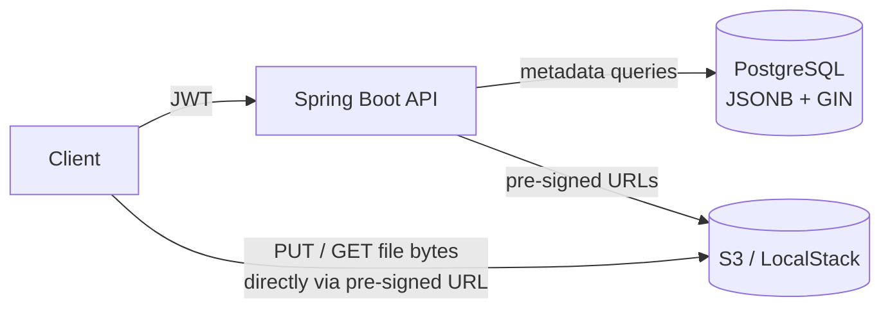

# DataCatalog

A metadata-driven data catalog: store data files in S3 together with rich, queryable metadata in PostgreSQL — upload/download via pre-signed URLs, secured with JWT, with search, filtering, pagination, and immutable versioning.

> **Status:** Phase 0 in progress — scaffolding complete, endpoints under construction.

## The problem

Data files scattered across shared drives and buckets are effectively lost: nobody knows what exists, who owns it, or which version is current. DataCatalog gives every file a catalog entry with queryable metadata, so datasets can be found, versioned, and downloaded through one API.

## Architecture



File bytes never pass through the application tier — the API issues pre-signed S3 URLs and the client transfers directly to/from object storage.

## Tech stack

Java 21 · Spring Boot 3 · Spring Security (JWT / OAuth2 resource server) · Spring Data JPA · PostgreSQL (JSONB + GIN) · Liquibase · AWS S3 (LocalStack for local dev) · Gradle · JUnit + Testcontainers · Playwright (API E2E) · GitHub Actions · Docker Compose

## Run it

```bash
docker compose up
curl localhost:8080/health
```

Requires only Docker — the app image builds itself, and Postgres + LocalStack (S3) start alongside it.

To develop locally:

```bash
./gradlew build        # downloads JDK 21 automatically via toolchain if needed
./gradlew bootRun
```

## API (Phase 0)

| Method | Path | Purpose |
|---|---|---|
| POST | `/v1/datasets` | Create catalog entry → `datasetId` |
| POST | `/v1/datasets/{id}/versions` | Request upload → pre-signed PUT URL |
| POST | `/v1/datasets/{id}/versions/{vid}/complete` | Record size/checksum, state → ACTIVE |
| GET | `/v1/datasets/{id}` | Dataset + latest version + metadata |
| GET | `/v1/datasets?q=&tag=&owner=&page=&limit=` | Search / filter, paginated |
| GET | `/v1/datasets/{id}/versions/{vid}/download` | Pre-signed GET URL |
| PATCH | `/v1/datasets/{id}` | Update metadata |

## Design decisions

*To be expanded as each slice lands:*

- **Pre-signed URLs** — why file bytes bypass the app tier
- **PostgreSQL + JSONB (GIN index)** — flexible metadata that stays queryable, without a second store
- **Immutable versions with a PENDING → ACTIVE state machine** — why upload is a two-step protocol
- **Sync API, no async pipeline yet** — and where a queue would slot in
- **No multipart upload yet** — implies a practical size cap; how multipart would be added

## AI-assisted development

This project is built with [Claude Code](https://claude.com/claude-code) as a deliberate exercise in AI-assisted engineering: spec-first prompts, incremental vertical slices, tests written alongside every change, and human review of every diff. Commits carry `Co-Authored-By: Claude` trailers; the agent's project instructions live in [CLAUDE.md](CLAUDE.md).
