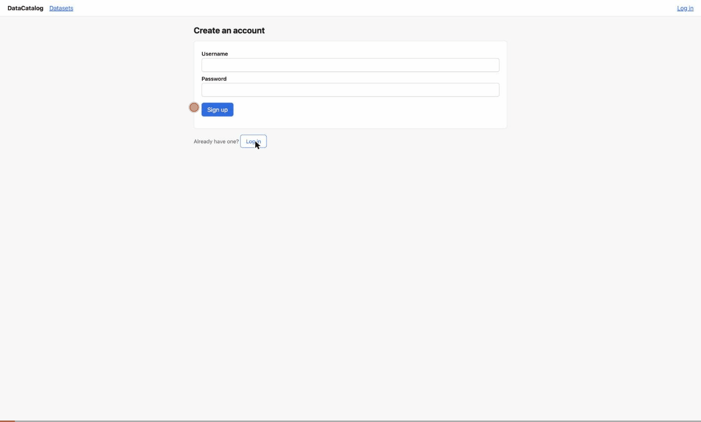
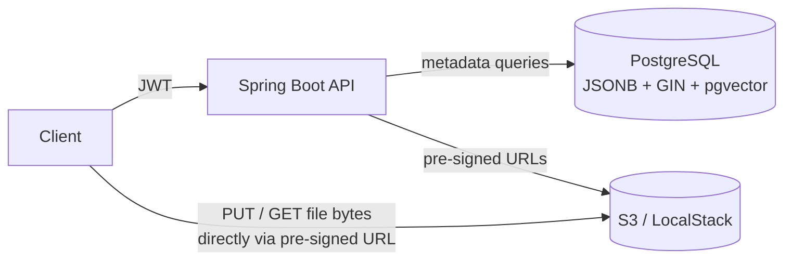

# DataCatalog

[](https://github.com/yutcai/datacatalog/actions/workflows/ci.yml)

Data files scattered across shared drives and buckets are effectively lost: nobody knows what exists, who owns it, or which version is current. DataCatalog gives every file a catalog entry with queryable metadata and immutable versions, so datasets can be found, versioned, and transferred straight to S3 through one small API.



*Register → create a dataset with queryable JSON metadata → edit it (an owner-scoped partial update) → search the catalog, in the thin React UI. The pre-signed S3 upload/download round trip is covered by a [browser E2E test](e2e/tests/download.spec.ts) and the curl walkthrough below.*

**Stack:** Java 21 · Spring Boot 3 · PostgreSQL (JSONB + GIN, pgvector) · Liquibase · AWS S3 pre-signed URLs (LocalStack locally) · JWT (OAuth2 resource server) · React + Vite · JUnit + Testcontainers · Playwright · GitHub Actions · Docker Compose

> **Status:** the core catalog API and the thin web UI are shipped and green in CI. Current work is semantic search on pgvector, landing in small reviewed PRs — embeddings are already populated on the write path; the similarity query and search endpoint are next. Phase-by-phase Definition of Done: [docs/ROADMAP.md](docs/ROADMAP.md).

## How it works


```mermaid
flowchart LR
    Client -->|JWT| API[Spring Boot API]
    API -->|metadata queries| PG[("PostgreSQL<br/>JSONB + GIN + pgvector")]
    API -->|pre-signed URLs| S3[(S3 / LocalStack)]
    Client -->|"PUT / GET file bytes<br/>directly via pre-signed URL"| S3
```

File bytes never pass through the application tier: the API issues short-lived pre-signed S3 URLs and the client transfers directly with object storage. Postgres holds everything queryable — catalog entries, immutable version records, and user-defined metadata as indexed JSONB. Sequence, state-machine, and ER diagrams: [docs/ARCHITECTURE.md](docs/ARCHITECTURE.md).

## Design decisions

The five decisions that most shaped the system, and the trade-offs behind them (full rationale in [docs/ARCHITECTURE.md](docs/ARCHITECTURE.md)):

**Uploads are a two-step protocol the server verifies.** `request-upload` creates a `PENDING` version and returns a pre-signed PUT URL; the client sends the bytes straight to S3. Because the server never witnesses that transfer, `complete` doesn't trust the client: it `HEAD`s the object and flips the version to `ACTIVE` — recording the size and checksum it observed — only if the bytes really landed. An abandoned upload just stays `PENDING`: invisible to search and download, harmless, cheap to expire with a lifecycle rule.

**Metadata is JSONB with a GIN index — not an EAV table, not a document DB.** Per-dataset metadata is user-defined, so it can't live in fixed columns, yet it must stay queryable. Indexed JSONB containment (`metadata @> '{"region": "emea"}'`) gives both, inside the same transactional store as the relational data. The alternatives lose: EAV turns every multi-key filter into self-joins, and a document DB adds an operational dependency while giving up joins.

**Token validation is decoupled from token issuance.** The app validates JWTs as a standard OAuth2 resource server, and the acting user is always the verified token `sub` — never a request-body field. It happens to issue tokens too, so the demo is self-contained, but swapping the issuer for a real IdP (Cognito, Keycloak, …) is an `issuer-uri` config change; the validation half doesn't move.

**Liquibase owns the schema; Hibernate only validates.** Versioned SQL changesets (each with a rollback) run on startup, and `ddl-auto: validate` turns entity/schema drift — say, a forgotten changeset — into an explicit boot failure instead of a silently auto-created column in production.

**Offset pagination, chosen with its limits on the table.** `page`/`limit` with a `{items, page, limit, total}` envelope is simple and correct at catalog scale; the known trade-off is that deep offsets scan-and-skip and concurrent inserts can shift rows across pages. The `ORDER BY (created_at, id)` tiebreaker is already a valid keyset cursor, so moving to seek-based pagination at scale is a `WHERE` clause, not a redesign.

## Testing

Built test-first: every slice starts with a failing test that is watched to fail before any implementation exists — a test that passes immediately proves nothing about itself.

- **60+ backend tests** (JUnit + Testcontainers) run against a real Postgres 16 with pgvector and a real S3 API (LocalStack) — no H2, no mocked repositories. The schema leans on JSONB, GIN indexes, `text[]`, `vector`, and check constraints that in-memory lookalikes don't honestly emulate; the query a test asserts on is byte-for-byte the query production runs.
- **Browser E2E** (Playwright) drives the real React UI against the full compose stack. The [download spec](e2e/tests/download.spec.ts) walks the whole story — create a dataset, upload through the browser straight to S3, download it back, assert the bytes match — and exists because that flow once broke in a way only a real browser could show (a silently popup-blocked `window.open`).
- **CI on every push and PR**: a `build` job (unit + component tests) and an `e2e` job that boots the compose stack, runs Playwright, and uploads the HTML report as an artifact.

The process behind this — including bugs that test-first caught and test-after would have missed — is documented in [docs/DEVELOPMENT.md](docs/DEVELOPMENT.md).

## Run it

The only prerequisite is Docker (with Compose v2).

```bash
git clone https://github.com/yutcai/datacatalog.git && cd datacatalog
docker compose up
curl localhost:8083/health    # → {"status":"UP",...}
```

One command builds and starts the API on **:8083**, Postgres, LocalStack S3, and the web UI on **[localhost:3000](http://localhost:3000)** — Liquibase migrates the schema on startup. Swagger UI is at [localhost:8083/swagger-ui.html](http://localhost:8083/swagger-ui.html) (a dev convenience, disabled under the `prod` profile). Reset to a clean slate any time with `docker compose down -v`.

<details>
<summary><b>Walk the full API with curl</b> — register → two-step upload → search → PATCH</summary>

The full happy path — auth, the two-step upload and download, then search and a partial update. (Uses `jq` to capture ids/URLs; or run each call alone and copy the values by hand.)

```bash
# 1. Register + exchange credentials for a JWT
curl -s -X POST localhost:8083/v1/auth/register -H 'Content-Type: application/json' \
  -d '{"username":"alice","password":"s3cret-pw"}' -w '-> %{http_code}\n'
TOKEN=$(curl -s -X POST localhost:8083/v1/auth/token -H 'Content-Type: application/json' \
  -d '{"username":"alice","password":"s3cret-pw"}' | jq -r .accessToken)

# 2. Create a dataset — the owner is taken from the token, never the body
DATASET=$(curl -s -X POST localhost:8083/v1/datasets -H "Authorization: Bearer $TOKEN" \
  -H 'Content-Type: application/json' \
  -d '{"name":"sales-2025","tags":["sales","emea"],"metadata":{"region":"emea"}}' | jq -r .id)

# 3. Request an upload -> a PENDING version + a pre-signed S3 PUT URL
REQUEST=$(curl -s -X POST localhost:8083/v1/datasets/$DATASET/versions -H "Authorization: Bearer $TOKEN")
VERSION=$(echo "$REQUEST" | jq -r .versionId)
PUT_URL=$(echo "$REQUEST" | jq -r .uploadUrl)

# 4. Upload bytes DIRECTLY to S3 with the pre-signed URL — they never pass through the app.
#    (swap in a real file with `--upload-file ./some.csv`; confirm it landed via
#    "Inspect the internals" below)
echo -n 'hello data catalog' | curl -s -o /dev/null -w 'upload -> %{http_code}\n' \
  -X PUT --data-binary @- "$PUT_URL"

# 5. Complete -> the server HEADs the object and flips the version PENDING -> ACTIVE
curl -s -X POST localhost:8083/v1/datasets/$DATASET/versions/$VERSION/complete \
  -H "Authorization: Bearer $TOKEN"; echo

# 6. Download -> a pre-signed GET URL; fetch the same bytes back
DL_URL=$(curl -s localhost:8083/v1/datasets/$DATASET/versions/$VERSION/download \
  -H "Authorization: Bearer $TOKEN" | jq -r .downloadUrl)
curl -s "$DL_URL"; echo    # -> hello data catalog

# 7. Search -> filter by free-text / tag / owner, offset-paginated {items,page,limit,total}
curl -s "localhost:8083/v1/datasets?q=sales&tag=emea&page=0&limit=10" \
  -H "Authorization: Bearer $TOKEN" | jq '{total, names: [.items[].name]}'

# 8. Patch -> partial update; metadata is MERGED by key, and only the owner may modify
curl -s -X PATCH localhost:8083/v1/datasets/$DATASET \
  -H "Authorization: Bearer $TOKEN" -H 'Content-Type: application/json' \
  -d '{"description":"reviewed for Q3","metadata":{"reviewed":true}}' \
  | jq '{description, metadata}'    # region kept, reviewed added

# Auth is enforced: the same call without a token -> 401
curl -s -o /dev/null -w 'no token -> %{http_code}\n' localhost:8083/v1/datasets/$DATASET
```

</details>

<details>
<summary><b>Develop against source</b> — infra in Docker, API and UI with fast feedback</summary>

```bash
docker compose up -d postgres localstack   # infra only
./gradlew bootRun                          # API on :8083
./gradlew test                             # tests boot their own disposable Postgres + S3 via Testcontainers
```

No JDK setup needed: the Gradle wrapper is checked in, and the build auto-provisions JDK 21 through the toolchain resolver on first run.

For UI work with hot reload, start the backend only — `docker compose up -d app postgres localstack` — then `cd ui && npm install && npm run dev` and open **localhost:5173**. Vite proxies `/v1` and `/health` to the app and reloads on save. (Under `docker compose up`, nginx serves the built SPA on :3000 and reverse-proxies the API, so the browser talks to a single origin — no CORS.)

Two local-dev notes:

- **Credentials:** compose starts Postgres with throwaway `datacatalog`/`datacatalog` credentials that exist only inside your machine's Docker network (override with `DB_PASSWORD=… docker compose up`). Production injects real values from the environment — the repo defines *which* configuration exists, the environment supplies its *values*.
- **Data lifecycle:** Postgres has a named volume, so catalog records survive restarts; LocalStack does not, so uploaded file bytes are wiped whenever its container is rebuilt. After a rebuild, an old version may download as "no longer in local storage" — re-upload it, or `docker compose down -v` for a consistent clean slate. This is a local-dev artifact only; real S3 is durable.

</details>

<details>
<summary><b>Inspect the internals</b> — psql into Postgres, list what landed in S3</summary>

**Postgres** (no install needed — psql runs inside the container; or point any client at `localhost:5432`, database/user/password all `datacatalog`):

```bash
docker compose exec postgres psql -U datacatalog -d datacatalog
```

```sql
select username, created_at from users;               -- registered users
select id, name, tags, metadata from datasets;        -- catalog entries (JSONB metadata)
select dataset_id, version_number, state, size_bytes  -- versions: PENDING vs ACTIVE
  from file_versions order by created_at;
select * from databasechangelog;                      -- what Liquibase migrations ran
```

**S3** (no install needed — `awslocal` ships inside the LocalStack container; or use the AWS CLI with access key/secret `test`/`test` against endpoint `http://localhost:4566`):

```bash
docker compose exec localstack awslocal s3 ls s3://datacatalog --recursive
```

Every object key is `datasets/<datasetId>/versions/<uuid>`. This is how to confirm a pre-signed PUT really landed: after step 4 of the curl walkthrough, `s3 ls` shows the object — and `complete` only flips the version to ACTIVE because the server sees that same object via a HEAD request.

</details>

<details>
<summary><b>API surface</b> — 11 endpoints: auth (3) + catalog (8)</summary>

Authentication:

| Method | Path | Purpose |
|---|---|---|
| POST | `/v1/auth/register` | Create a user (password stored BCrypt-hashed) |
| POST | `/v1/auth/token` | Exchange username/password → signed JWT |
| GET | `/v1/me` | Current user, derived from the JWT (protected) |

Catalog (all protected — require a `Bearer` token):

| Method | Path | Purpose |
|---|---|---|
| POST | `/v1/datasets` | Create catalog entry → `datasetId` |
| POST | `/v1/datasets/{id}/versions` | Request upload → pre-signed PUT URL |
| GET | `/v1/datasets/{id}/versions` | List the dataset's ACTIVE versions, newest first |
| POST | `/v1/datasets/{id}/versions/{vid}/complete` | Record size/checksum, state → ACTIVE |
| GET | `/v1/datasets/{id}` | Dataset + latest version + metadata |
| GET | `/v1/datasets?q=&tag=&owner=&page=&limit=` | Search / filter, paginated |
| GET | `/v1/datasets/{id}/versions/{vid}/download` | Pre-signed GET URL |
| PATCH | `/v1/datasets/{id}` | Partial update; metadata merged by key, owner-only |

The raw OpenAPI spec is at `/v3/api-docs` on a running instance.

</details>

## Built with AI, under review

This project is deliberately built with [Claude Code](https://claude.com/claude-code) as an exercise in AI-assisted engineering: spec-first slices, tests written before implementation, small PRs gated by CI, and human review of every diff. Commits carry a `Co-Authored-By: Claude` trailer, the agent's standing constraints live in [CLAUDE.md](CLAUDE.md), and [docs/DEVELOPMENT.md](docs/DEVELOPMENT.md) documents the workflow — including where the AI's first attempt was wrong and how it was caught.
