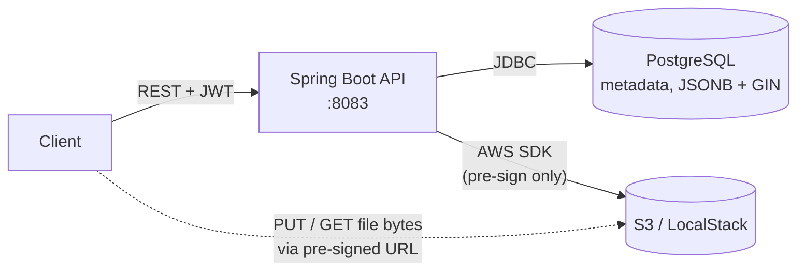
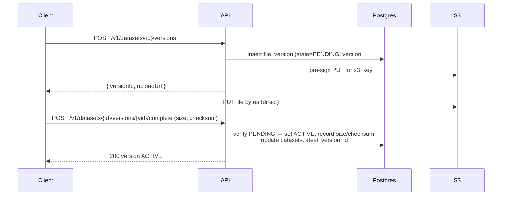
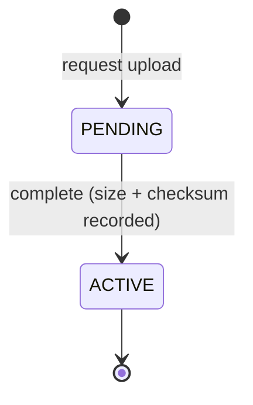

# Architecture

Living document — updated as each slice lands. Items marked **(designed)** are specified but not yet implemented; everything else is built and tested.

## System context



The API is a stateless metadata service. It never touches file bytes: uploads and downloads go directly between the client and S3 using short-lived pre-signed URLs issued by the API. Postgres holds everything queryable — catalog entries, immutable version records, and user-defined metadata as indexed JSONB.

## The core flow: two-step upload



Upload is deliberately a two-step protocol: the server cannot observe a direct-to-S3 transfer, so the version record is created in `PENDING` and only becomes visible (searchable, downloadable) when the client confirms completion. Abandoned uploads stay `PENDING` and are excluded from reads.

### Version state machine



No other transitions exist. Version rows are immutable once `ACTIVE`; a new upload always creates a new version. The valid states are enforced at the database level by a check constraint, and uniqueness of `(dataset_id, version_number)` by a constraint — invalid transitions are impossible to persist, not merely discouraged.

## Code layout

Package-by-feature: each package is a vertical slice owning its controller, service, repository, and entities.

```
io.datacatalog
├── auth/       register / token endpoints, JWT issuing
├── user/       User entity + repository, /v1/me (current user)
├── config/     SecurityConfig (resource server), JwtConfig
├── common/     error handling (RFC 7807 ProblemDetail), pagination   (designed)
├── dataset/    create / get / search (filter + paginate) / PATCH
├── storage/    S3 pre-signing + object verification
└── version/    FileVersion lifecycle (request-upload/complete/download)
```

## Persistence

Schema is owned by [Liquibase changesets](../src/main/resources/db/changelog/) (formatted SQL, each with a rollback); Hibernate runs `ddl-auto: validate`. ER diagram in the [README](../README.md#data-model). Notable choices:

- `datasets.metadata jsonb` + GIN (`jsonb_ops`) — containment and key-existence queries
- `datasets.tags text[]` + GIN — tag filtering without a join table
- `datasets.latest_version_id` — denormalized hot-path read ("dataset + latest version"), maintained on version completion; circular FK added in its own changeset
- `file_versions` — immutable, unique `(dataset_id, version_number)`, state restricted by check constraint

## Cross-cutting

- **Auth:** OAuth2 resource server; every request outside `/health` and `/v1/auth/**` is authenticated by a signed JWT (RS256). The current user is always derived from the token `sub` — never from a request body. The app also issues tokens (`/v1/auth/token`, BCrypt password check) with a per-instance RSA key; issuance is decoupled from validation so a real IdP can replace it via `issuer-uri`. Minimal `users` table backs ownership.
- **Errors (designed):** RFC 7807 `application/problem+json` everywhere via Spring's `ProblemDetail`.
- **Configuration:** all connection settings come from environment variables; the repo ships only throwaway local-dev defaults. See [README → Secrets](../README.md#secrets-stay-out-of-the-repo).
- **Health:** Actuator at `GET /health` with liveness/readiness groups, wired into compose healthchecks.
- **API docs:** springdoc serves an OpenAPI 3 spec (`/v3/api-docs`) and Swagger UI (`/swagger-ui.html`), both permitted without auth so the API is browsable. Disabled under the `prod` profile so the surface isn't published in production.

## Security & non-functional requirements

Security is treated as a first-class concern, not a later hardening pass. What is built today:

- **Authentication:** every endpoint except `/health` and `/v1/auth/**` requires a signed RS256 JWT (resource-server validation).
- **Identity integrity:** the acting user is always the verified token `sub`, never a request-body field — a client cannot claim to own a resource it does not.
- **Authorization:** writes are owner-scoped — a non-owner `PATCH` returns 403, enforced against the dataset's `owner_id`; reads stay open so the catalog is discoverable.
- **Credentials & session:** passwords are BCrypt-hashed; sessions are stateless with no cookies, so CSRF protection (which guards cookie auth) is disabled by design rather than by omission.
- **Injection:** all persistence goes through JPA/parameterized queries; search filters bind parameters, never string-concatenated SQL.
- **Secrets:** every connection setting is injected from the environment; the repo ships only throwaway local-dev defaults. Production supplies real values from a secret store, and can drop the DB password entirely via IAM database auth (S3 already uses IAM roles, not keys).
- **Storage exposure:** pre-signed URLs are short-lived (15-minute TTL); downloads are issued only for `ACTIVE` versions; the Swagger surface is disabled under the `prod` profile.

Other non-functional properties already shaped by the design:

- **Reliability / consistency:** `ACTIVE` is a server-verified fact (HEAD), version rows are immutable, the state set is enforced by a DB check constraint, and writes are transactional.
- **Performance / scale:** the app is stateless (scales horizontally); JSONB and `tags` each carry a GIN index; `latest_version_id` is denormalized for the hot read; file bytes are offloaded to S3 instead of proxied; list/search is paginated.
- **Operability:** Actuator liveness/readiness back the compose healthchecks; configuration follows 12-factor env injection; the schema is migration-owned (Liquibase) with rollbacks.
- **Correctness surface:** request DTOs are bean-validated; errors are uniform RFC 7807 `ProblemDetail`.

Deliberately deferred — scoped to a later phase, not overlooked:

- **Edge protections:** rate limiting / quotas and audit logging are gateway/WAF and Phase 2 concerns, not in the app today.
- **Observability depth:** metrics, tracing, and SLOs (incl. consumer lag) arrive in Phase 2; only health checks exist now.
- **Async resilience:** retry/backoff, dead-letter topics, and idempotent consumers are Phase 2, alongside the Kafka backbone.
- **Transport & storage limits:** TLS is terminated at the ingress in production (not in-app); the single-PUT upload implies a practical size cap until multipart (Phase 3).

## Testing strategy

- **Component tests** (JUnit + Testcontainers): real Postgres 16 per test JVM via `@ServiceConnection`; schema, constraints, and JSONB queries are verified against the engine that runs in production — not an emulator.
- **E2E (designed):** Playwright drives the full API against the compose stack (create → upload to LocalStack → complete → search → download), plus 401 / 404 / PENDING-download edge cases. Runs in CI.

## Where Phase 1+ slots in

The boundaries are already shaped for the roadmap: LLM enrichment and embedding generation hang off the `complete` event (today synchronous-only; a queue consumer would subscribe there); semantic search adds a pgvector column beside the existing JSONB; the MCP server is a thin adapter over the same dataset/version services. Details and acceptance criteria in [ROADMAP](ROADMAP.md).
